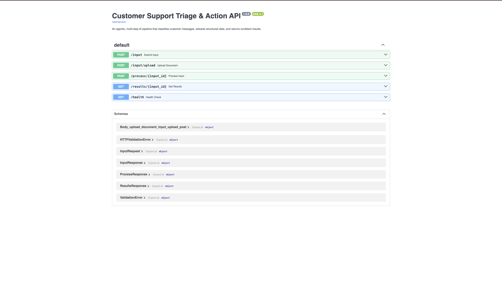
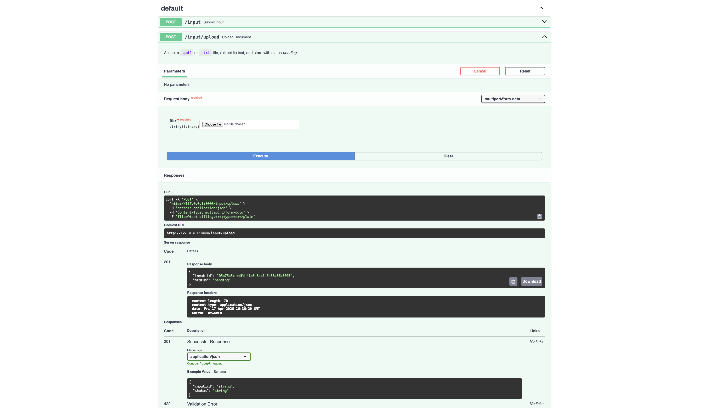
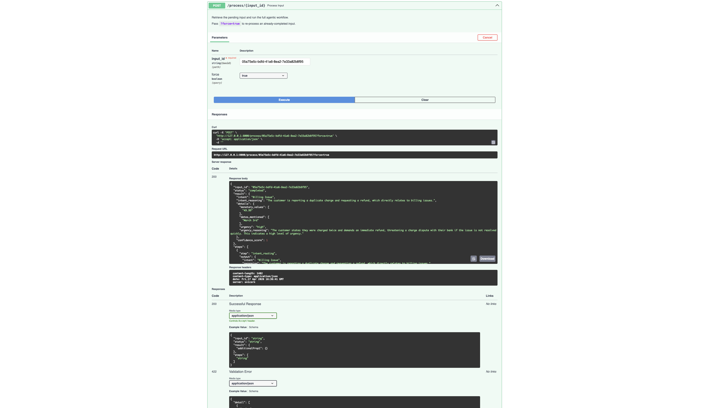

# Agentic Customer Support Triage API

An intelligent, API-based workflow system that acts as an automated dispatcher for incoming customer support messages and documents. 

Instead of relying on rigid keyword matching, this system uses an **Agentic LLM Workflow** to dynamically read, route, and extract structured data from support tickets, preparing them for immediate downstream processing.

<p align="center">
  
</p>

---

## Core Features
* **Agentic Routing:** The system doesn't just run a single prompt; it reads the intent and dynamically decides which extraction branch to execute (Technical Support, Billing, or General Feedback).
* **Guaranteed Structured Output:** Bypasses "prompt-engineering-only" approaches by utilizing Pydantic models paired with the Gemini API's native `response_schema`, ensuring 100% deterministic JSON outputs.
* **Document Processing:** Supports direct text ingestion or file uploads (`.txt` and `.pdf`).
* **Resilience Built-in:** Implements exponential backoff and retry logic (`tenacity`) to gracefully handle rate limits or transient API failures.
* **Transparent Pipeline:** Returns intermediate outputs so frontends can display the AI's "thought process" step-by-step.

---

## Setup & Installation

**Prerequisites:** Python 3.9+

1. **Clone the repository:**
   ```bash
   git clone https://github.com/YOUR_USERNAME/YOUR_REPO_NAME.git
   cd YOUR_REPO_NAME
   ```

2. **Install dependencies:**
   ```bash
   pip install -r requirements.txt
   ```

3. **Set your environment variable:**
   Duplicate the `.env.example` file, rename it to `.env`, and insert your Google Gemini API key. (Note: The system is configured to use `gemini-2.0-flash` for high-speed, low-cost reasoning).
   ```bash
   cp .env.example .env
   # Edit .env and add your API key
   ```

4. **Run the server:**
   ```bash
   python -m uvicorn main:app --reload
   ```

The API will be live at `http://127.0.0.1:8000`. You can access the interactive Swagger UI at `http://127.0.0.1:8000/docs`.

---

## API Usage Examples

<p align="center">
  
</p>
<p align="center">
  
</p>

### 1. Ingest Data
Accepts raw text or document uploads, assigns a tracking UUID, and stores the state.

**Option A: Text Input**
```bash
curl -X POST "http://127.0.0.1:8000/input" \
     -H "Content-Type: application/json" \
     -d '{"text": "My laptop screen is completely black and will not turn on."}'
```

**Option B: Document Upload**
```bash
curl -X POST "http://127.0.0.1:8000/input/upload" \
     -F "file=@/path/to/support_ticket.pdf"
```
*(Returns `{"input_id": "YOUR_UUID", "status": "pending"}`)*

### 2. Process the Workflow
Runs the multi-step AI agent on the stored input.
```bash
curl -X POST "http://127.0.0.1:8000/process/YOUR_UUID"
```
*Bonus Feature: Pass `?force=true` to bypass the cache and force the AI to re-evaluate the input.*

### 3. Fetch Results
Retrieve the finished, structured JSON payload.
```bash
curl -X GET "http://127.0.0.1:8000/results/YOUR_UUID"
```

---

## Workflow Design Explanation

The system utilizes a **3-Step Triage & Action Pipeline**:

1. **Step 1: Intent Routing (The Agent):** The LLM acts as a high-level dispatcher. It reads the raw text and categorizes it into one of three predefined intents.
2. **Step 2: Conditional Execution:** Based on the output of Step 1, the code dynamically routes the payload to a specific extraction handler.
   - **Technical Support** extracts hardware/software entities and generates troubleshooting steps.
   - **Billing Issues** extracts monetary values, dates, and calculates urgency.
   - **General Feedback** extracts sentiment and drafts a polite reply.
3. **Step 3: Confidence Scoring:** A final evaluation determines how reliable the extracted data is, allowing downstream systems to flag low-confidence tickets for human review.

**Why this is scalable:** By using a dictionary-based **Handler Dispatch Pattern** (`_INTENT_HANDLERS`), adding 20 new departments is an `O(1)` routing operation. We simply add a new Pydantic schema and a handler function without bloating the codebase with massive if/else chains.

---

## AI Usage & Strategy

### Prompt Design Approach
I opted for a highly constrained, context-specific prompting approach. Rather than writing one massive "do everything" prompt, the prompts are isolated by concern. Step 1 only cares about intent. Step 2 only cares about precise data extraction for its specific domain. This separation of concerns heavily reduces LLM hallucinations.

### How Outputs Were Structured
Guaranteeing JSON output is a notoriously difficult problem in AI engineering. Rather than relying on fragile prompt engineering (e.g., "Please output JSON only"), I utilized the Gemini SDK's native `response_schema` parameter. By defining strict Python Pydantic models and passing them directly to the LLM as the required output schema, the formatting burden is shifted to the model's inference engine, ensuring 100% deterministic, parseable data.

### Assumptions & Limitations
- **Limitation:** The current system uses an in-memory dictionary for data persistence. If the FastAPI server restarts, pending and completed tasks are lost.
- **Assumption:** It is assumed that uploaded PDFs contain selectable text. OCR for image-based PDFs is currently outside the scope of this iteration.

---

## Engineering Trade-offs & Decisions

### Direct SDK Integration vs. Heavy Frameworks (LangChain)
- **Decision:** I deliberately avoided using orchestrators like LangChain or LlamaIndex, opting to use the native `google-genai` SDK.
- **Why:** While LangChain is great for prototyping, its heavy abstractions often obscure the actual API calls and make debugging difficult in production. Writing native Python logic with standard if/else routing makes this codebase significantly more readable, performant, and defensible.

### In-Memory Storage vs. Relational Database
- **Decision:** Used a thread-safe Python dictionary to mock database operations.
- **Why:** To optimize for the reviewer's setup experience. Requiring a PostgreSQL instance via Docker would add unnecessary friction to evaluating the core AI logic. The `database.py` file is structured with standard CRUD methods so it can be swapped for an SQLAlchemy implementation in minutes.

---

## Personal Reflection & Learning Curve

Building this system was a highly rewarding exercise in bridging the gap between "prompt engineering" and actual "software engineering."

Initially, my approach to AI involved writing overly complex prompts hoping the model would figure out the routing and extraction all at once. Through this project, my biggest takeaway was learning to treat the LLM not as a magic black box, but as a standard functional component within a pipeline.

By isolating tasks (routing vs. extraction) and strictly enforcing data shapes with Pydantic, I learned how to build AI systems that don't just "chat," but actually operate deterministically enough to trust in a production backend. This assignment solidified my understanding of how to build resilient, fault-tolerant AI applications.
